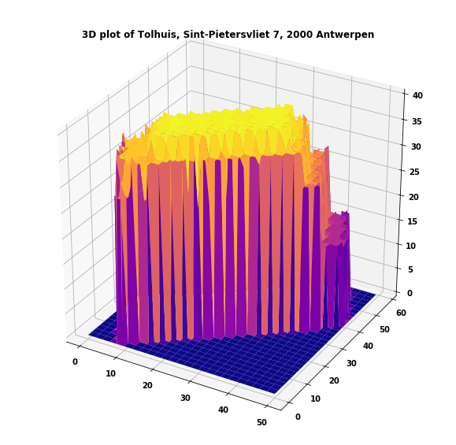
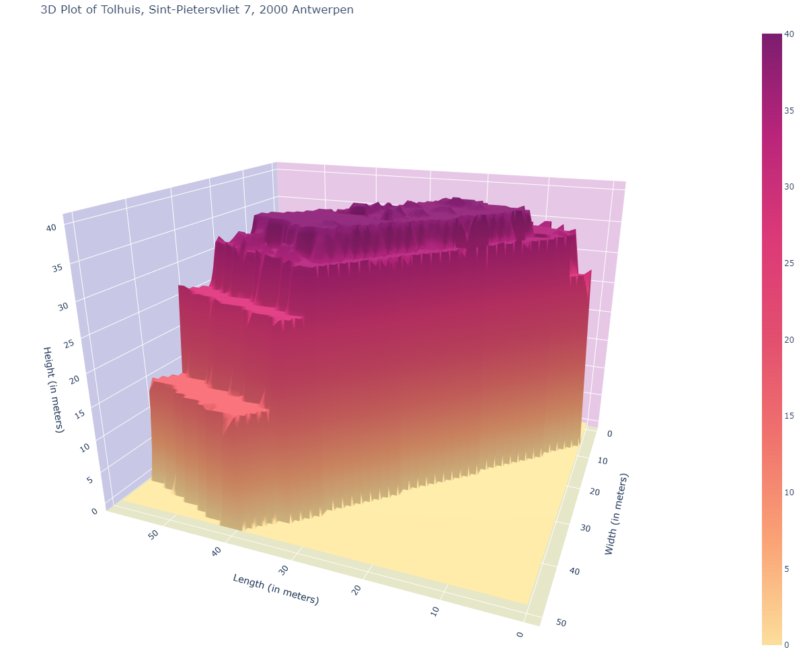

# 3D-Houses

### The Mission

We are LIDAR PLANES, active in the Geospatial industry. We would like to use our data to launch a new branch in the insurance business. So, we need you to build a solution with our data to model a house in 3D with only a home address.

### Mission objectives

Consolidate the knowledge in Python, specifically in :

* NumPy
* Pandas
* Matplotlib

### Learning Objectives

* to be able to search and implement new libraries
* to be able to read and use the shapefile format
* to be able to read and use geoTIFFs
* to be able to render a 3D plot
* to be able to present a final product

### Must-have features

* 3D lookup of houses.

### Nice-to-have features

* Optimize your solution to have the result as fast as possible.
* Features like the living area of the house in m², how many floors, if there is a pool, the vegetation in the neighborhood, etc...
* Better visualization.

### Process 

1. RESEARCH : The project involved researching and reading about various file types(.tif and .shp files) and their use. Also, finding out the necessary libraries required to work with them.

2. COLLECTION OF DATA: The next step was to collect the required information from the Data Surface Model(DSM) and Data Terrain Model(DTM) files (which can be found on https://www.geopunt.be website) and save them in a CSV file using pandas library.

3. PROCESSING OF DATA : This involved:

* getting the coordinates from an address, 
* converting it to the reference system of the tif file, 
* finding the file number of the tif file in the .csv file, from the coordinates,
* creating the polygon of the location which is the actual shape of the location,
* using that shape to crop the tif files.

4. DATA VISUALIZATION : From the cropped tif files of DSM and DTM, Canopy Height Model(CHM) can be found, which is the difference between DSM and DTM. Using that array which represents the elevation of the property, a 3-D plot could be plotted.

### VISUALS

### TIMELINE

Duration: 2 weeks
From: 25/10/21
Deadline: 04/11/21 17:00 PM

### CHALLENGES

* Understanding the content of .tif and .shp files (contained in DSM and DTM files) and how to work with them.
* Finding the right libraries and their installation.
* How to proceed with the data extracted from .tif files.
* Finding the right .tif file from the coordinates of the location needed to be plotted.
* Creating the polygon and changing its CRS.

### FURTHER IMPROVEMENT

I would like to improve the code by:
* Working on the nice to have features.
* Masking(clipping/cropping) the .tif files using the polygon with transformed Coordinate Reference System(CRS).
* Processing the .tif files without downloading them.
* Plotting locations whose coordinates are divided in two or more .tif files.
